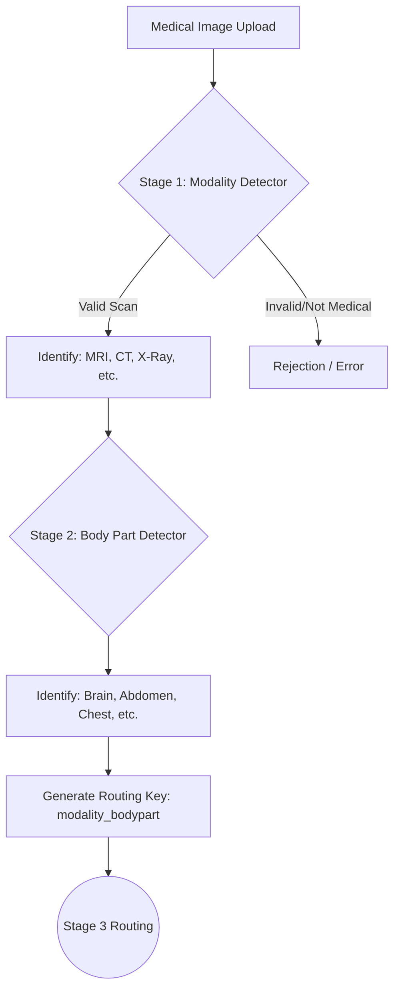

# MedVision AI — Clinical Scan Intelligence Engine

MedVision AI is a production-grade, two-stage medical scan analysis system designed to standardize the intake and routing of medical imaging data. By leveraging deep learning architectures, the system automatically detects scan modalities and anatomical regions, producing a deterministic routing key for downstream disease-specific diagnostic models.

## 📋 Overview

In large-scale clinical environments, medical images must be triaged before being analyzed for specific pathologies. MedVision AI automates this initial phase through a multi-stage inference pipeline:

1.  **Stage 1 — Modality Detection**: Identifies the type of scan (e.g., MRI, CT, X-Ray).
2.  **Stage 2 — Anatomical Analysis**: Determines the body region captured in the scan.
3.  **Routing Key Generation**: Synthesizes a unique identifier (e.g., `mri_brain`) used to route the scan to the appropriate Stage 3 pathology detection model.

## 🏗️ Technical Architecture

The system is built on a decoupled architecture, separating the high-performance inference backend from the clinical reasoning frontend.

### AI Inference Pipeline

The core intelligence consists of two sequential CNN models utilizing the **EfficientNet** architecture, chosen for its optimal balance between parameter efficiency and top-1 accuracy.

*   **Stage 1: Scan Type Detector**
    *   **Backbone**: EfficientNet-B4
    *   **Classes**: Chest X-Ray, Brain MRI, CT Scan, Ultrasound, PET, Not Medical.
    *   **Confidence Threshold**: 0.70
*   **Stage 2: Body Part Detector**
    *   **Backbone**: EfficientNet-B3
    *   **Classes**: Chest, Brain, Abdomen, Spine, Knee, Breast, Hand, Eye.
    *   **Confidence Threshold**: 0.65

### Execution Flow



## 🛠️ Technology Stack

### Machine Learning (ML)
*   **PyTorch**: Primary framework for model definition and inference.
*   **timm (PyTorch Image Models)**: Used for EfficientNet backbones.
*   **Albumentations**: Advanced image preprocessing and normalization.
*   **NumPy / Pillow**: Image data manipulation.

### Backend
*   **FastAPI**: High-performance asynchronous API framework.
*   **Uvicorn**: ASGI server implementation.
*   **Python-Multipart**: Handling large medical image uploads.

### Frontend
*   **React (Vite)**: Component-based UI for the reasoning dashboard.
*   **Framer Motion**: State-driven animations for "AI Skill" visualization.
*   **Lucide React**: Engineering-focused iconography.
*   **Vanilla CSS + Tailwind**: Custom design system with glassmorphism aesthetics.

## 📁 Repository Structure

```text
MedVision/
├── Med_Backend/                # Python FastAPI Inference Server
│   ├── main.py                 # Application entry point
│   ├── src/
│   │   ├── api/                # API route definitions & payloads
│   │   ├── models/             # PyTorch model definitions (EfficientNet)
│   │   └── pipeline/           # Inference orchestration (Two-stage logic)
│   └── requirements.txt        # Backend dependencies
│
├── Med_Frontend/               # React Dashboard
│   ├── src/
│   │   ├── components/         # Modular UI (Skill Execution, Result Cards)
│   │   ├── hooks/              # Custom state machines (Pipeline tracking)
│   │   └── index.css           # Global design system & layout
│   └── package.json            # Frontend dependencies
│
└── README.md                   # System documentation
```

## 🚀 Installation & Setup

### 1. Backend Setup
Ensure you have Python 3.9+ installed.

```bash
cd Med_Backend
pip install -r requirements.txt
python -m uvicorn main:app --reload --port 8000
```

### 2. Frontend Setup
```bash
cd Med_Frontend
npm install
npm run dev
```

## 📊 Example API Response

The system returns a structured JSON object containing confidence scores and the finalized routing key.

```json
{
  "stage1_modality": "pet",
  "stage1_confidence": 85.2,
  "stage2_body_part": "abdomen",
  "stage2_confidence": 84.8,
  "routing_key": "pet_abdomen",
  "ready_for_stage3": true
}
```

## 🔮 Future Work

*   **Stage 3 Integration**: Deployment of specialized disease classification models for each routing key.
*   **Multi-Organ Detection**: Support for scans containing multiple anatomical regions.
*   **Explainability (XAI)**: Implementation of Grad-CAM (Gradient-weighted Class Activation Mapping) to visualize AI focus areas.
*   **DICOM Support**: Direct processing of clinical DICOM files including metadata extraction.
*   **Model Quantization**: Optimizing inference for edge deployment in clinical settings.

---
*Disclaimer: This system is intended for research and development purposes only. It is not a certified medical device and should not be used for clinical diagnosis.*
